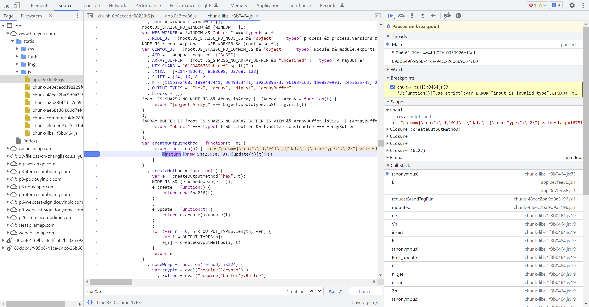

### 目标
[红人点集](https://www.hrdjyun.com/) 记录各大主流电商直播数据

用Python 实现登录 和 爬取数据

### 步骤1：登录
访问首页时会得到一些 js 文件，其中1个 app.js，包含了一段加密逻辑
用来对 pwd 进行加密，
同时将手机号、加密后的密码、时间戳、并配合1个固定的字符串 进行加密
用这些参数，发起 post 请求，得到 token

### 步骤2：获取数据
用数据模块的参数（1个页面包含多个不同属性的数据块），加上时间戳，加上 salt，做sha256 得到 sign
然后综合数据模块参数，sign，时间戳，token 再次发起请求，即可得到数据

### 收获
#### JS代码的调用
还是用 execjs 模块，但是和之前在 AQI 案例中的用法不同
之前是把要执行的代码和参数拼接成1个JS，执行得到结果
这里是要将参数传入，然后执行得到结果

#### JS逆向
要能入，更要能出
在第2步获取数据的实现上，差点儿掉坑里，被 JS 代码套进去
因为有关注到 salt，以及sha256 都是通过 JS 函数得到的，所以研究半天对应的 JS代码
但实际上 salt 是固定值，sha256 是标准库函数

#### Python 和 JS 在 JSON 格式化上的区别
Python 为了看起来美观，会自动增加空格，而JS不会

#### data_param 的处理
作为 post 的请求参数时，要对 引号做转义，前面增加 \
作为 sha256 的参数时，不需要做转义

